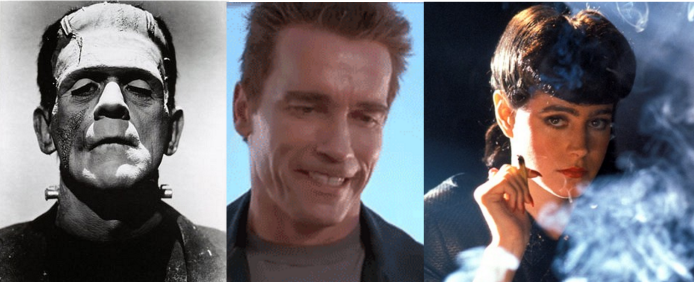

#Artifical Life: Virtual Creatures

###Automaton
Early example of explorations of artificial life are the automaton of the 1700s. One of the earliest is the Digesting Duck, which is an automaton in the form of a duck, created by Jacques de Vaucanson in 1739. The mechanical duck appeared to have the ability to eat kernels of grain, and to metabolize and defecate them.   
  
As [Simon Norfolk obserces](http://www.instituteartist.com/feature-I-m-Sorry-Dave-I-m-Afraid-I-Can-t-Do-That-Simon-Norfolk) that the duck provoked a philosophical crisis:   
  
*"If it could perform so many functions that were like life and yet it was a machine, then it begged the question what exactly is life? For the first time with any clarity it raised the important question ‘in what way do humans essentially differ from very complicated machines?’*
  
Decades later the [Mechanical Turk automaton](https://en.wikipedia.org/wiki/The_Turk), a chess playing robot that appeared to be able to win against very skilled human players, provoked a related question of human versus machine intelligence. 
  

Only later it was found out that its maker,  Wolfgang von Kempelen, has designed it with a secret compartment inside, where he would pay retired grand master chess players to hide and play against oponents, controlling pieces using levers. Amazon has very cynically named their [online labour service MTurk](https://www.mturk.com/mturk/welcome) in reference to this. 

Science fiction is full of [intelligent artificial life forms](https://en.wikipedia.org/wiki/Artificial_intelligence_in_fiction) which embody out hopes, dreams and anxieties for the technologies we build. Through these characters we see questions asked of control, agency and what it means to be human. 
  
  

###Cybernetics and emergence
The interdisciplinary field of cybernetics also explores these questions. Of note, are the cybernetic experiments of Dr. Grey Walter an English neurologist and roboticist. In 1949 Walter built [reactive autonomous robots](http://www.theoldrobots.com/ElmerElsie.html) without the aid of computer processors or microcontrollers, these could wander about and avoid obstacles. Most famous were his turtles Elmer and Elsie which he thought of as electronic 'brains'.  
  

  
Walter' turtles were propositions that intelligence, rather than being a higher level property were, situated, emergent and pre-cognitive and are still cited in cybernetic literature today.   
  
A more recent example of an artistic explorations of these theme's today is the early work of [Heather Dewey Hagborg.](http://deweyhagborg.com/) Here she describes some key concepts of artificial life such as emergence, bottom up models for intelligence and the irreducibility of complex systems.   
  

   
  
###Artificial Life in Media Art
Media art history is packed with examples of artificial lifeforms that continue to explore the cultural, aesthetic and political implications of the promise of technology, what it means to be think, be alive, or have intelligence. [Mitchell Whitelaw](http://mtchl.net/) gives a solid review of the field in [MetaCreation.](https://mitpress.mit.edu/books/metacreation). 
    
Some key examples of artificial life artworks are:  
    
* The quite terrifying [Senstor by Edward Ihnatowicz](http://www.senster.com/ihnatowicz/), 1974.  
   
<a href="https://www.youtube.com/watch?v=hoZb5MTKzQc">  
* Many examples of [Laurent Mignonneau & Christa Sommerer's](http://www.interface.ufg.ac.at/christa-laurent/) artworks. Who have also done fantastic work developing tangible and unusual interfaces using [water](https://www.youtube.com/watch?v=cZ3v1jcCXmk), [plants](http://www.interface.ufg.ac.at/christa-laurent/WORKS/FRAMES/FrameSet.html), [typewriters.](http://www.interface.ufg.ac.at/christa-laurent/WORKS/FRAMES/FrameSet.html)  
  
* A more recent contribution is [Delicate Boundaries](http://csugrue.com/delicateboundaries/) by [Chris Sugrue](http://chrissugrue.com/)
  
  
* And the software based creatures curated by [Golan Levin](http://www.flong.com/) in his [Single Cell](http://www.singlecell.org/singlecell.html) and [Double Cell](http://www.singlecell.org/) collections if Processing works. 
 

