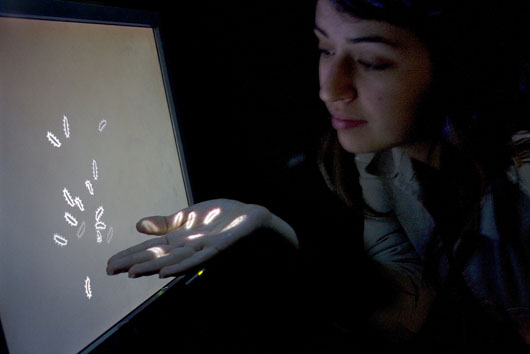
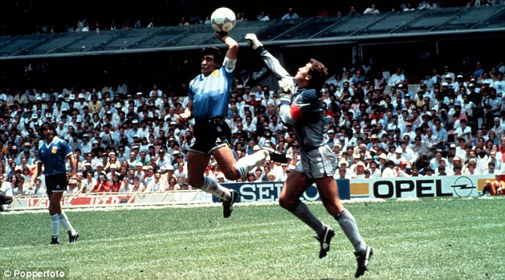

#Artifical Life: Virtual Creatures

###Automaton
Early explorations of artificial life are the automaton of the 1700s. One of the earliest is the Digesting Duck created by Jacques de Vaucanson in 1739. The mechanical duck appeared to have the ability to eat kernels of grain, and to metabolize and defecate them.   
  
As [Simon Norfolk observes,](http://www.instituteartist.com/feature-I-m-Sorry-Dave-I-m-Afraid-I-Can-t-Do-That-Simon-Norfolk) the duck provoked a philosophical crisis:   
  
*"If it could perform so many functions that were like life and yet it was a machine, then it begged the question what exactly is life? For the first time with any clarity it raised the important question ‘in what way do humans essentially differ from very complicated machines?’*
  
Of course it was later revealed that the duck did not actually metabolize but was preloaded with ducky dung. Decades later the [Mechanical Turk automaton](https://en.wikipedia.org/wiki/The_Turk) - a chess playing robot that appeared to be able to win against very skilled human players, provoked a related question of human versus machine intelligence. 
  

Yet once again it was found to be a fraud.  Wolfgang von Kempelen, had designed it with a secret compartment inside, where he would pay retired grand master chess players to hide and play against oponents, controlling pieces using levers. Amazon has very cynically named their [online labour service MTurk](https://www.mturk.com/mturk/welcome) in reference to this. 

Science fiction is full of [intelligent artificial life forms](https://en.wikipedia.org/wiki/Artificial_intelligence_in_fiction) which embody out hopes, dreams and anxieties for the technologies we build. These characters pose questions of control, agency and what it means to be human. 
  
  

###Cybernetics and emergence
The interdisciplinary field of cybernetics that emerged after WW2 also explores these questions. Of note, are the cybernetic experiments of Dr. Grey Walter an English neurologist and roboticist. In 1949 Walter built [reactive autonomous robots](http://www.theoldrobots.com/ElmerElsie.html) without the aid of computer processors or microcontrollers, these could wander about and avoid obstacles. Most famous were his turtles Elmer and Elsie which he thought of as electronic 'brains'.  
  

  
Walter' turtles were a proposition that intelligence is not a higher level property and rather is, situated, emergent and pre-cognitive. They are still widely cited in cybernetic literature today.   
  
A more recent example of an artist exploring of these theme's today, is the early work of [Heather Dewey Hagborg.](http://deweyhagborg.com/) In this video she describes some key concepts of her work Bugs, and artificial life such as emergence, bottom up models for intelligence and the irreducibility of complex systems.   
  

   
  
###Artificial Life in Media Art
Media art history is packed with examples of artificial lifeforms that consider the cultural, aesthetic and political implications of the promise of technology, what it means to be think, be alive, or have intelligence. [Mitchell Whitelaw](http://mtchl.net/) gives a solid review of the field in [MetaCreation.](https://mitpress.mit.edu/books/metacreation). 
    
Some key examples of artificial life artworks are:  
    
* The quite terrifying [Senstor by Edward Ihnatowicz](http://www.senster.com/ihnatowicz/), 1974.  
   
<a href="https://www.youtube.com/watch?v=hoZb5MTKzQc">  
* Many examples of [Laurent Mignonneau & Christa Sommerer's](http://www.interface.ufg.ac.at/christa-laurent/) artworks. Who have also done fantastic work developing tangible and unusual interfaces using [water](https://www.youtube.com/watch?v=cZ3v1jcCXmk), [plants](http://www.interface.ufg.ac.at/christa-laurent/WORKS/FRAMES/FrameSet.html), [typewriters.](http://www.interface.ufg.ac.at/christa-laurent/WORKS/FRAMES/FrameSet.html) 
    
  
* A more recent contribution is [Delicate Boundaries](http://csugrue.com/delicateboundaries/) by [Chris Sugrue](http://chrissugrue.com/)
  
  
* And the software based creatures curated by [Golan Levin](http://www.flong.com/) in his [Single Cell](http://www.singlecell.org/singlecell.html) and [Double Cell](http://www.singlecell.org/) collections if Processing works.  
   
 
##Cases for testing Artificial Intelligence
* As seen in the Mechanical Turk, chess has always been a site where artificial intelligence has been tested. 1996 was a devestating year for human chess, being the first time a computer, [IBM's deep blue,](https://en.wikipedia.org/wiki/Deep_Blue_(chess_computer)) beat a grand master chess player.
* More recently, human computer collaborative teams are now leading chess in a form of called ['Advanced Chess' or 'Centaur Chess'.](https://en.wikipedia.org/wiki/Advanced_Chess) they take advantage of being an unpredictable human and having the 'brute force' of a calculting machine.
* For more on this, watch this great talk by [James Bridle on chess and AI in sports.](https://www.youtube.com/watch?v=PNq0jZvctJE). The whole thing is great but particularly from 16min-29min where he explores chess,  how computers make decisions in sports, and what that shows us about our attitudes towards computers making decisions that were once made by humans.
* Surely the computers would prevent this whole dreadful 'hand of god' sitation from happening again...

*   

